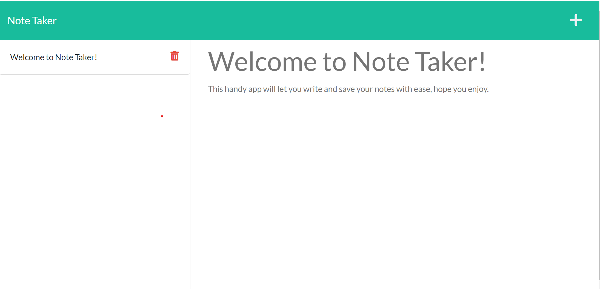

# Note Taker

  An front end app utilizing express to allow for the saving, accessing and deleting of notes using back end code.

  ## Table of Contents

  - [Installation](#installation)
  - [Usage](#usage)
  - [License](#license)
  - [Contributing](#contributing)
  - [Questions](#questions)

  ## Installation

  Install the npm dependencies listed in package.json

  ## Usage

  Easy way of reading, creating or deleting notes that is based on the db.json, allowing for notes to easily be saved or other note databases to be inserted.

  ## License

  No Licenses

  ## Contributing

  Open source, feel free to use as you like.

  ## Questions

  - Check out my other repositories at [GitHub Profile](https://github.com/c-phillips7)

  - For any questions, contact me at cp.phillips15@gmail.com.

